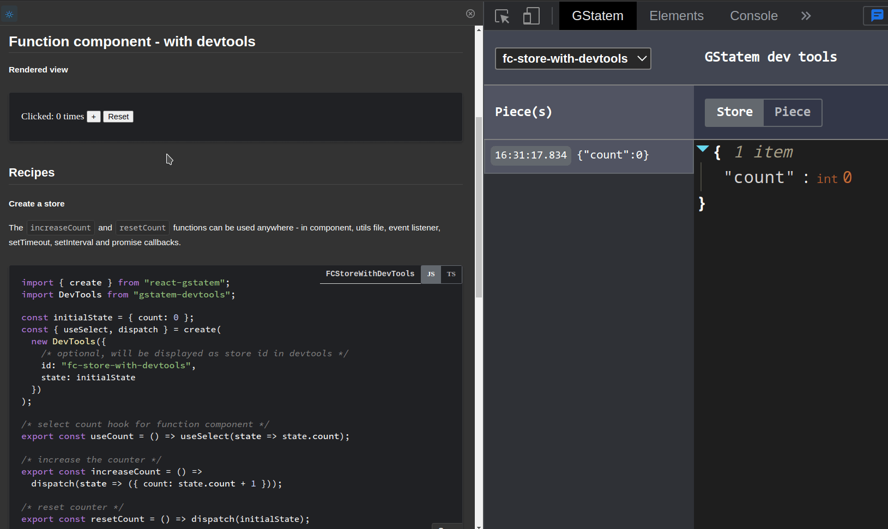

The DevTools helpers for [gstatem](https://www.npmjs.com/package/gstatem) and [react-gstatem](https://www.npmjs.com/package/react-gstatem).

## Installation
### npm
```shell
npm i gstatem-devtools
```

### yarn
```shell
yarn add gstatem-tools
```

### [Demos](https://gstatem.netlify.app/?path=/docs/react-function-component-with-devtools--page)

## Usage

The `increaseCount` function can be used anywhere - in component, utils file, event listener, setTimeout, setInterval and promise callbacks.

### Create a store with Devtools
```typescript jsx
// Store.js
import { create } from "react-gstatem";
import DevTools from "gstatem-devtools";

const { useSelect, dispatch } = create(
  new DevTools({ 
    /* initial state */
    state: { count: 0 } 
  })
);

/* the count hook for function component */
export const useCount = () => useSelect(state => state.count);

/* increase the counter */
export const increaseCount = () => dispatch(state => ({ count: state.count + 1 }));
```

### Use in component
```typescript jsx
import React from "react";
import Counter from "./Counter";
import { useCount, increaseCount } from "./Store";

const BasicUsage = () => {
  const count = useCount();
  return (
    <Counter value={count} onIncrement={increaseCount} />
  );
};

export default BasicUsage;
```

Every dispatched piece will be logged in the Chrome extension [GStatem-DevTools](https://chrome.google.com/webstore/detail/gstatem-devtools/djohekcenmdagbolgaiiphdnmhgmpllk) if the devtools is installed.

<kbd>
    
</kbd>